# System Operation and Logic

This document details the internal mechanisms used to distribute data across the network and reconstruct it, ensuring security, space efficiency, and high availability.

## 1. Data Distribution (Upload)

The upload process transforms a single file into many optimized, anonymous fragments scattered across the network.

### A. Preparation (Sharding Pipeline)

When a user uploads a file, the `ShardManager` executes an in-memory transformation pipeline:

1. **Block Reading**: The file is segmented into fixed-size chunks (1MB).
2. **Compression**: Each chunk is individually compressed using the **LZMA (Preset Extreme)** algorithm.

   > _Goal_: Dramatically reduce network traffic and disk space required on remote nodes.

3. **Encryption**: The compressed chunk is encrypted with the Fernet algorithm (AES-128 in CBC mode with SHA256 HMAC).

   > _Key_: A unique key is generated for each upload session.

4. **Binary Packing**: The encrypted payload (normally Base64 url-safe) is decoded into **Raw Binary Bytes** before sending.

   > _Optimization_: Avoids the typical 33% Base64 overhead, saving pure bits on disk.

5. **Hashing**: The SHA-256 hash of the final blob is computed to generate the unique `chunk_id`.

### B. Distribution Strategy (Redundancy & Scattering)

The `DistributionStrategy` manages data dispersion:

1. **Beacon Discovery**: The client listens for UDP broadcast beacons (Port 5000) to instantly map all active nodes in the LAN.
2. **Node Selection**: For each chunk, **5 distinct nodes** are selected randomly (Replication Factor $N=5$).

   > This redundancy ensures data survival even if 4 out of 5 custodian nodes go offline simultaneously.

3. **Parallel Upload**: Blobs are uploaded in parallel via HTTP/1.1 (Keep-Alive) to maximize throughput.

### C. Manifest Creation

At the end of the upload, a `.manifest` (JSON) file is generated on the client side:

- Contains the decryption key (required to read the data).
- Contains the ordered list of chunk hashes.
- **Privacy**: Does not contain original file names or node IP addresses (location is found dynamically during restore via Network Query).

---

## 2. Data Reconstruction (Download)

The client does not know the data location a priori; it must discover it.

### A. Network Querying (Fully Dynamic)

The client analyzes the `.manifest` and for each chunk launches a **Network Query**:

1. **Query Flooding / Random Walk**: The client asks known entry nodes for the specific `chunk_id`.
2. **Optimized Retrieval**: Downloads the binary blob from the first node that responds with the data, effectively finding the data wherever it is stored in the network without pre-stored locations.

### B. Restore Pipeline (Reverse Engineering)

The received blob undergoes the reverse process of upload:

1. **Binary Unpack**: Reads raw bytes.
2. **Decryption**: Uses the Fernet key from the manifest.
3. **Decompression**: Expands data via LZMA.
4. **Assembly**: Writes the byte stream to the correct position in the final file.

## Flow Diagram (Sequence)

```mermaid
sequenceDiagram
   autonumber
   participant Client as 👤 Client (App)
   participant Engine as ⚙️ Processing Engine
   participant Network as 🌐 P2P Network (50+ Nodes)
   participant Manifest as 📜 Manifest File

   Note over Client, Network: 📤 Phase 1: Distribution (Secure Pipeline)
   Client->>Engine: Stream File (1MB Chunks)

   loop For each Chunk
      Engine->>Engine: 1. Compress (LZMA Extreme)
      Engine->>Engine: 2. Encrypt (Fernet Key)
      Engine->>Engine: 3. Binary Pack (Base64 Decode)
      Engine->>Network: 4. Parallel PUT /chunk/{id} (To 5 Nodes)
      Network-->>Client: 200 OK (x5)
   end

   Client->>Manifest: Save Key + ChunkHashes

   Note over Client, Network: 📥 Phase 2: Restore (Zero-Knowledge)
   Client->>Manifest: Load Manifest (Key + IDs)
   Client->>Network: Discover Peers (UDP Beacon)

   loop For each Chunk
      Client->>Network: Query Availability (Who has {id}?)
      Network-->>Client: I have it! (Node X)
      Client->>Network: GET /chunk/{id}
      Network-->>Client: Raw Binary Stream

      Client->>Engine: 1. Decrypt (Fernet)
      Client->>Engine: 2. Decompress (LZMA)
      Engine->>Client: Write Original Bytes
   end
```



## 3. Redundancy Strategy (Cluster Resilience)

The system is designed to ensure data availability even in case of massive disconnections (high churn rate).

### Replication Topology (5x)

The architecture uses a **Simple Replication** model with factor $N=5$.
Unlike Erasure Coding systems (e.g., Reed-Solomon) which require CPU-intensive reconstruction, simple replication favors read latency and immediate resilience.

- **Node Selection**: During upload, the client selects 5 random nodes from the discovered pool. No rigid DHT (Distributed Hash Table) is used to avoid rebalancing complexity in volatile local networks.
- **High Availability**: This ensures data is accessible as long as at least **1 of the 5 custodian nodes** remains online and reachable.
- **Implicit Load Balancing**: Since each chunk chooses a different set of 5 nodes, storage and bandwidth load is evenly distributed across the cluster (Statistical Load Balancing).

```mermaid
graph TD
   classDef active fill:#198754,stroke:#333,stroke-width:2px,color:white;
   classDef offline fill:#dc3545,stroke:#333,stroke-width:2px,stroke-dasharray: 5 5,color:white;
   classDef chunk fill:#0d6efd,stroke:#333,stroke-width:2px,color:white;

   File["📂 Original File"] --> Split["✂️ Split, Compress & Encrypt"]
   Split --> Chunk1["📦 Chunk #X"]:::chunk

   subgraph "Storage Cluster (Mesh)"
      direction LR
      Chunk1 -- Replica 1 --> N1["🖥️ Node 04"]:::active
      Chunk1 -- Replica 2 --> N2["🖥️ Node 12"]:::active
      Chunk1 -- Replica 3 --> N3["❌ Node 27 (OFFLINE)"]:::offline
      Chunk1 -- Replica 4 --> N4["🖥️ Node 33"]:::active
      Chunk1 -- Replica 5 --> N5["🖥️ Node 48"]:::active
   end

   Client["👤 Client Downloader"]

   Client -->|"1. Discovery"| N1
   Client -->|"1. Discovery"| N2
   Client -.->|Timeout| N3
   Client -->|"2. Download (Fastest)"| N4

   Note["The network withstands the loss of N nodes.\nJust 1 active replica is enough for restore."]
```



## 4. Network Topology & Discovery

The network is fully decentralized and coordinator-free (Master-less). Discovery occurs via broadcast protocols, eliminating the need for manual configuration.

### Communication Protocols

The network implements a hybrid UDP/HTTP approach to maximize speed and reliability.

#### 1. Discovery Layer (UDP Broadcast)

This layer manages real-time node "presence".

- **Port**: 5000/UDP
- **Frequency**: 1 Hz (1 packet per second)
- **Payload**: A lightweight JSON packet containing node identity:

  ```json
  { "node_id": "uuid-v4...", "port": 808X, "status": "active" }
  ```

- **Mechanism**: Fire-and-forget. The client maintains an in-memory routing table (volatile TTL). If a node stops sending beacons for >5 seconds, it is removed from the active peers list.

#### 2. Data Transport Layer (HTTP/1.1)

Once the IP and port are obtained from the UDP beacon, data exchange occurs over reliable channels.

- **REST API**: Each node exposes standard endpoints (`POST /chunk`, `GET /chunk/{id}`, `HEAD /chunk/{id}`).
- **Performance**: The client uses `aiohttp` to handle hundreds of non-blocking concurrent connections, allowing it to query the entire network in milliseconds during the search phase (Flood Query).

```mermaid
graph TD
   classDef node fill:#198754,stroke:#333,stroke-width:2px,color:white;
   classDef client fill:#0d6efd,stroke:#333,stroke-width:2px,color:white;
   classDef link stroke:#666,stroke-width:1px,stroke-dasharray: 5 5;

   Client["👤 Client App"]:::client

   subgraph "Local Area Network (LAN)"
      direction BT
      N1["🖥️ Node 01"]:::node
      N2["🖥️ Node 02"]:::node
      N3["🖥️ Node 50"]:::node
   end

   %% Broadcast Discovery
   Client -.-o|"🔊 UDP Broadcast (Hello!)"| N1
   Client -.-o|"🔊 UDP Broadcast (Hello!)"| N2
   Client -.-o|"🔊 UDP Broadcast (Hello!)"| N3

   %% Mesh interactions (logical)
   N1 <-->|"Gossip"| N2
   N2 <-->|"Gossip"| N3

   Note["📡 Auto-Discovery:<br/>No configuration needed.<br/>Just start a node and it<br/>automatically joins the Mesh."]
```


