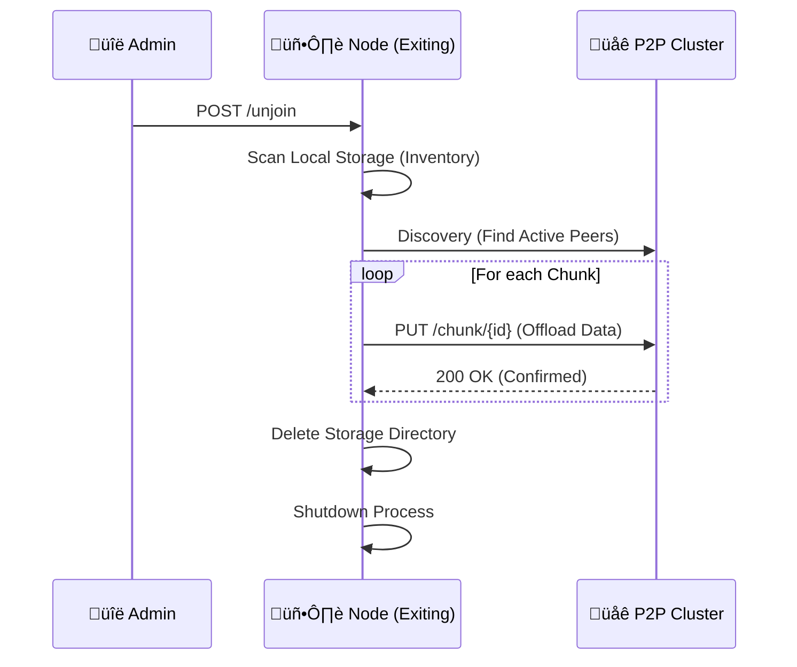

# System Operation and Logic

This document details the internal mechanisms used to distribute data across the network and reconstruct it, ensuring security, space efficiency, and high availability.

## 1. Data Distribution (Upload)

The upload process transforms a single file into many optimized, anonymous fragments scattered across the network.

### A. Preparation (Sharding Pipeline)

When a user uploads a file, the `ShardManager` executes an in-memory transformation pipeline:

1. **Block Reading**: The file is segmented into fixed-size chunks (1MB).
2. **Compression**: Each chunk is individually compressed using the **LZMA (Preset Extreme)** algorithm.

   > _Goal_: Dramatically reduce network traffic and disk space required on remote nodes.

3. **Encryption**: The compressed chunk is encrypted with the Fernet algorithm (AES-128 in CBC mode with SHA256 HMAC).

   > _Key_: A unique key is generated for each upload session.

4. **Binary Packing**: The encrypted payload (normally Base64 url-safe) is decoded into **Raw Binary Bytes** before sending.

   > _Optimization_: Avoids the typical 33% Base64 overhead, saving pure bits on disk.

5. **Hashing**: The SHA-256 hash of the final blob is computed to generate the unique `chunk_id`.

### B. Distribution Strategy (Redundancy & Scattering)

The `DistributionStrategy` manages data dispersion:

1. **Beacon Discovery**: The client listens for UDP broadcast beacons (Port 9999) to instantly map all active nodes in the LAN.
2. **Node Selection**: For each chunk, **5 distinct nodes** are selected randomly (Replication Factor $N=5$).

   > This redundancy ensures data survival even if 4 out of 5 custodian nodes go offline simultaneously.

3. **Parallel Upload**: Blobs are uploaded in parallel via HTTP/1.1 (Keep-Alive) to maximize throughput.

### C. Manifest Creation

At the end of the upload, a `.manifest` (JSON) file is generated on the client side:

- Contains the decryption key (required to read the data).
- Contains the ordered list of chunk hashes.
- **Privacy**: Does not contain original file names or node IP addresses (location is found dynamically during restore via Network Query).

---

## 2. Data Reconstruction (Download)

The client does not know the data location a priori; it must discover it.

### A. Network Querying (UDP Broadcast)

The client analyzes the `.manifest` and for each chunk launches a **UDP Search**:

1. **UDP Broadcast Query**: The client broadcasts a `QUERY_CHUNK` message to the entire network (UDP Port 9999).
2. **Asynchronous Response**: Nodes holding the requested chunk respond directly with an `I_HAVE` message containing their URL.
3. **Optimized Retrieval**: The client creates a list of "owners" and performs a direct HTTP GET from one of the active nodes.

This removes the need for "Flooding" or "Crawling" via HTTP, making discovery instant and scalable.

### B. Restore Pipeline (Reverse Engineering)

The received blob undergoes the reverse process of upload:

1. **Binary Unpack**: Reads raw bytes.
2. **Decryption**: Uses the Fernet key from the manifest.
3. **Decompression**: Expands data via LZMA.
4. **Assembly**: Writes the byte stream to the correct position in the final file.

## Flow Diagram (Sequence)

```mermaid
sequenceDiagram
   autonumber
   participant Client as 👤 Client (App)
   participant Engine as ⚙️ Processing Engine
   participant Network as 🌐 P2P Network (50+ Nodes)
   participant Manifest as 📜 Manifest File

   Note over Client, Network: 📤 Phase 1: Distribution (Secure Pipeline)
   Client->>Engine: Stream File (1MB Chunks)

   loop For each Chunk
      Engine->>Engine: 1. Compress (LZMA Extreme)
      Engine->>Engine: 2. Encrypt (Fernet Key)
      Engine->>Engine: 3. Binary Pack (Base64 Decode)
      Engine->>Network: 4. Parallel PUT /chunk/{id} (To 5 Nodes)
      Network-->>Client: 200 OK (x5)
   end

   Client->>Manifest: Save Key + ChunkHashes

   Note over Client, Network: 📥 Phase 2: Restore (Zero-Knowledge)
   Client->>Manifest: Load Manifest (Key + IDs)
   Client->>Network: Discover Peers (UDP Beacon)

   loop For each Chunk
      Client->>Network: UDP Broadcast QUERY_CHUNK (Who has {id}?)
      Network-->>Client: UDP Unicast I_HAVE (Node X)
      Client->>Network: GET /chunk/{id} (To Node X)
      Network-->>Client: Raw Binary Stream

      Client->>Engine: 1. Decrypt (Fernet)

      Client->>Engine: 2. Decompress (LZMA)
      Engine->>Client: Write Original Bytes
   end
```



## 3. Redundancy Strategy (Cluster Resilience)

The system is designed to ensure data availability even in case of massive disconnections (high churn rate).

### Replication Topology (5x)

The architecture uses a **Simple Replication** model with factor $N=5$.
Unlike Erasure Coding systems (e.g., Reed-Solomon) which require CPU-intensive reconstruction, simple replication favors read latency and immediate resilience.

- **Node Selection**: During upload, the client selects 5 random nodes from the discovered pool. No rigid DHT (Distributed Hash Table) is used to avoid rebalancing complexity in volatile local networks.
- **High Availability**: This ensures data is accessible as long as at least **1 of the 5 custodian nodes** remains online and reachable.
- **Implicit Load Balancing**: Since each chunk chooses a different set of 5 nodes, storage and bandwidth load is evenly distributed across the cluster (Statistical Load Balancing).

```mermaid
graph TD
   classDef active fill:#198754,stroke:#333,stroke-width:2px,color:white;
   classDef offline fill:#dc3545,stroke:#333,stroke-width:2px,stroke-dasharray: 5 5,color:white;
   classDef chunk fill:#0d6efd,stroke:#333,stroke-width:2px,color:white;

   File["📂 Original File"] --> Split["✂️ Split, Compress & Encrypt"]
   Split --> Chunk1["📦 Chunk #X"]:::chunk

   subgraph "Storage Cluster (Mesh)"
      direction LR
      Chunk1 -- Replica 1 --> N1["🖥️ Node 04"]:::active
      Chunk1 -- Replica 2 --> N2["🖥️ Node 12"]:::active
      Chunk1 -- Replica 3 --> N3["❌ Node 27 (OFFLINE)"]:::offline
      Chunk1 -- Replica 4 --> N4["🖥️ Node 33"]:::active
      Chunk1 -- Replica 5 --> N5["🖥️ Node 48"]:::active
   end

   Client["👤 Client Downloader"]

   Client -->|"1. Broadcast Query (UDP)"| N1
   Client -->|"1. Broadcast Query (UDP)"| N2
   Client -.->|Timeout| N3
   Client -->|"2. Download (HTTP)"| N4

   Note["The network withstands the loss of N nodes.\nJust 1 active replica is enough for restore."]
```



## 4. Communication Protocol Specification

### Protocol Layers

The system relies on a dual-protocol stack: UDP for low-latency control and discovery, and HTTP for reliable data transfer.

#### A. Discovery & Control Layer (UDP)

- **Port**: `9999` (Broadcast)
- **Role**: Peer Discovery, Liveness, Content Search.

**1. HELLO Message (Beacon)**
Broadcasted every 1s by every active node.

- **Direction**: Broadcast -> Network
- **Payload**:
  ```json
  {
    "type": "HELLO",
    "port": 8000 // The HTTP port of sending node
  }
  ```

**2. QUERY_CHUNK Message (Search)**
Sent by a client or node looking for a specific chunk.

- **Direction**: Broadcast -> Network
- **Payload**:
  ```json
  {
    "type": "QUERY_CHUNK",
    "chunk_id": "a1b2c3d4..."
  }
  ```

**3. I_HAVE Message (Response)**
Unicast response from a node that holds the requested chunk.

- **Direction**: Node -> Requestor (Unicast)
- **Payload**:
  ```json
  {
    "type": "I_HAVE",
    "chunk_id": "a1b2c3d4...",
    "url": "http://192.168.1.50:8005"
  }
  ```

#### B. Data Transport Layer (HTTP/REST)

- **Ports**: Dynamic range (8000-80XX).
- **Role**: Heavy data transfer, Node Management.
- **Documentation**: OpenAPI spec available at `/openapi`.

**Endpoints:**

| Method   | Endpoint      | Description                                            |
| :------- | :------------ | :----------------------------------------------------- |
| **GET**  | `/chunks`     | **Inventory**. Returns list of all stored chunk IDs.   |
| **GET**  | `/chunk/{id}` | **Download**. Stream the binary content of the chunk.  |
| **PUT**  | `/chunk/{id}` | **Upload/Replicate**. Save a chunk to this node.       |
| **POST** | `/unjoin`     | **Leave**. Trigger graceful exit and data offload.     |
| **GET**  | `/status`     | **Health**. Node stats (peers count, storage usage).   |
| **GET**  | `/openapi`    | **Spec**. Returns full Swagger/OpenAPI 3.0 definition. |

---

## 5. Network Topology & Discovery

The network is fully decentralized and coordinator-free (Master-less). Discovery occurs via broadcast protocols, eliminating the need for manual configuration.

### Connectivity

The network implements a mesh topology where every node is potentially connected to every other node discovered via UDP.

```mermaid
graph TD
   classDef node fill:#198754,stroke:#333,stroke-width:2px,color:white;
   classDef client fill:#0d6efd,stroke:#333,stroke-width:2px,color:white;
   classDef link stroke:#666,stroke-width:1px,stroke-dasharray: 5 5;

   Client["👤 Client App"]:::client

   subgraph "Local Area Network (LAN)"
      direction BT
      N1["🖥️ Node 01"]:::node
      N2["🖥️ Node 02"]:::node
      N3["🖥️ Node 50"]:::node
   end

   %% Broadcast Discovery
   Client -.-o|"UDP: HELLO / QUERY"| N1
   Client -.-o|"UDP: HELLO / QUERY"| N2
   Client -.-o|"UDP: HELLO / QUERY"| N3

   %% Mesh interactions (logical)
   N1 <-->|"HTTP: Transfer"| N2
   N2 <-->|"HTTP: Transfer"| N3

   Note["📡 Auto-Discovery:<br/>Port 9999/UDP<br/>Data: HTTP API"]
```



## 6. Node Lifecycle Management

The lifecycle of a node consists of three main phases: Join, Active Participation, and Departure.


### A. Initialization & Join (Bootstrap)

When a node starts (`P2PServer` initialization):

1.  **Storage Check**: Ensures the `storage_dir` exists.
2.  **Service Binding**: Binds HTTP port for data transfer and UDP port (random or fixed) for discovery.
3.  **Presence Announcement**: Immediately starts broadcasting `HELLO` beacons via UDP to port 9999.
4.  **Integration**: Other nodes receive the beacon and add the new node to their in-memory peer lists. No central registration is required.

### B. Active State (Liveness)

- **Heartbeat**: The node continues to broadcast `HELLO` packets every second.
- **Responsive**: It answers `QUERY_CHUNK` broadcasts if it holds requested data.
- **Passive Maintenance**: It accepts `PUT` requests from other peers (re-balancing or upload) and `GET` requests for downloads.

### C. Graceful Unjoin Protocol (Planned Departure)

Nodes can leave the network without causing data loss through the "Unjoin" process (`POST /unjoin`):

1. **Inventory Analysis**: The node scans its local storage for all hosted chunks.
2. **Cluster Replica Discovery**: The node scans for available peers in the cluster via Discovery Service.
3. **Data Offloading**:
   - The node actively pushes (PUT) each chunk to a random active peer.
   - This prevents the replication factor from dropping.
4. **Self-Destruct**:
   - Once all data is transferred, the node recursively deletes its local storage directory.
   - The process terminates gracefully.



### D. Ungraceful Failure (Crash Recovery)

If a node crashes or is disconnected abruptly (Power loss, Network partition):

1. **Detection**:
   - The node stops sending UDP Beacons.
   - HTTP requests to the node fail (Timeout/Connection Refused).
2. **Impact**: The chunks hosted on that node become temporarily unavailable.
3. **Resilience**:
   - Due to $N=5$ redundancy, the file remains available on 4 other nodes.
   - The `RepairManager` (triggered manually or periodically) detects the missing replica during an audit and replicates the data to a new node to restore $N=5$.

```mermaid
flowchart TD
    Start[Repair Scan Started] --> Discover[Discover Active Nodes]
    Discover --> Check[Load File Manifest]
    Check --> Verify[Broadcast QUERY_CHUNK]

    Verify -- "5 Nodes Respond" --> OK[✅ Healthy]
    Verify -- "< 5 Nodes Respond" --> Loss[⚠️ Replica Loss Detected]

    Loss --> Select[Select New Candidate Node]
    Select --> Retrieve[Retrieve Chunk from a Survivor]
    Retrieve --> Replicate[PUT to New Candidate]

    Replicate --> Restore[✅ Redundancy Restored (N=5)]
```
