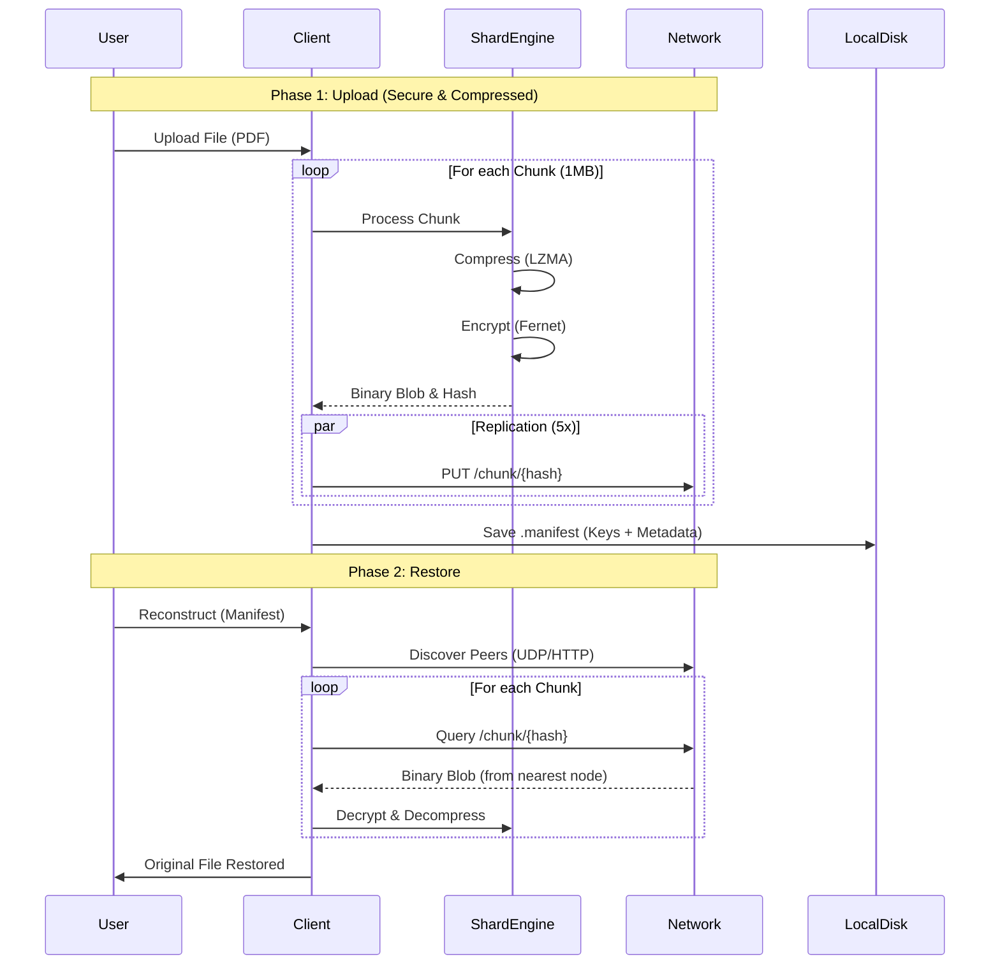

# Secure P2P Distributed Storage

An advanced peer-to-peer distribution and storage system designed to ensure security, anonymity, and high data availability within a local network.

## Main Features

- **Sharding & Encryption**: Files are split into blocks, compressed, and encrypted (Fernet 256-bit) before leaving the client.
- **Advanced Compression**: Uses the **LZMA Extreme** algorithm combined with an optimized binary storage format (no Base64 encoding) to minimize disk usage (~30% space saved).
- **Zero Knowledge**: Storage nodes only hold anonymous binary blobs. They do not possess decryption keys or metadata about the original files.
- **High Resilience**:
  - **5x Redundancy**: Each chunk is replicated across 5 distinct nodes.
  - **UDP Storage Search**: Data location is discovered in real-time using UDP Broadcast queries (`QUERY_CHUNK`) and DHT lookups.
  - **Auto-Discovery**: Automatic peer detection via UDP Broadcast (Port 9999) and iterative Kademlia-like DHT.
- **Total Privacy**: The "manifest" required to reconstruct the file contains no IP addresses.
- **Global Public Catalog**: Manifests can be optionally published to a distributed DHT Catalog, allowing any peer to discover and download files without prior possession of the manifest file.
- **Direct Streaming**: Files can be streamed directly from the distributed network to the browser without intermediate disk storage.
- **Robust Deletion**: Implements a reliable "Gossip" protocol for deletion propagation and a secure DHT cleanup mechanism to permanently remove file metadata.
- **Garbage Collection**: Built-in "Prune" functionality to identify and remove orphan chunks (data not referenced by valid manifests) to free up space.
- **Graceful Exit**: Nodes support a "Unjoin" operation to offload data to peers and clean up storage before shutting down.
- **Open Standards**: Full OpenAPI 3.0 documentation available on every node (`/openapi`).
- **Full Web Interface**: Dashboard to manage files, stream content, view network topology, and monitor real-time distribution.

## System Architecture

The system consists of autonomous nodes forming a dynamic mesh network.

### 1. Client (Uploader/Downloader)

- **Processing**: Split file -> Compression (Zlib/LZMA) -> Encryption (Fernet) -> Binary Pack.
- **Distribution**: Parallel sending to dynamically discovered nodes.
- **Manifest**: Generation of a local `.manifest` file containing cryptographic IDs, compression method, and the session key.

### 2. P2P Nodes

- **Async Architecture**: Fully asynchronous nodes based on `aiohttp` and `asyncio` for high concurrency.
- **Distributed Hash Table (DHT)**:
  - **Routing**: Kademlia-lite implementation for peer discovery.
  - **Storage**: Key-Value store supporting both atomic values and Append-Only Lists (for Catalog).
  - **Persistence**: Index is saved to `dht_index.sqlite` using SQLite for performance and reliability.
- **Gossip Protocol**: Used for propagating high-priority events like "Delete Chunk" and "Delete Manifest" to ensure eventual consistency across the mesh.
- No central database: each node only knows its direct neighbors and DHT routing table.

### Graphical Visualization

The project includes a visualization engine based on `vis.js` offering two views:

- **Network Topology**: Shows physical (P2P) connections between active nodes.
- **Distribution Map**: A sparse force-directed graph visualizing the logical flow of the file through the network (Hosts as nodes, Chunks as edges).

## Installation & Quick Start

### Prerequisites

- Python 3.9+
- Virtual environment recommended

### Setup

```bash
# 1. Create virtual environment
python3 -m venv venv
source venv/bin/activate

# 2. Install dependencies
pip install -r requirements.txt
```

### Start Full Simulation

To quickly launch a local test network with **50 preconfigured nodes** and the web interface:

```bash
# Automatic script (cleans old processes and restarts everything)
./restart_network.sh
```

_This will start 50 node processes (ports 8000-8049) and the Web UI on port 8888._

### Web UI Access

Open your browser at:  
👉 [http://localhost:8888](http://localhost:8888)

From the Web UI you can:

- Upload files (drag & drop).
- Download/Reconstruct files to server disk.
- **Stream** files directly to your browser.
- Delete files (Manifest + Network).
- **Prune** orphan chunks to free space.
- View the distribution map.

## Detailed Project Structure

```text
src/
├── core/               # Core logic (Encryption, Sharding, Metadata)
├── network/            # Networking (Nodes, P2P Server, Discovery)
├── web/                # Frontend (HTML/JS)
├── web_ui.py           # Backend server for the UI
└── main.py             # CLI Entry point

logs/                   # Execution logs for individual nodes
manifests/              # Manifests of uploaded files (client side)
network_data/           # Simulated physical storage for 50 nodes
script/                 # Utility scripts (start/stop/restart)
```

## Manual Commands (CLI)

You can also interact with the system via command line:

**Start a single node:**

```bash
python3 src/main.py start-node --port 8001 --storage-dir ./data_node1
```

**Upload a file:**

```bash
# --scan uses discovery to automatically find nodes
python3 src/main.py distribute -f my_document.pdf --scan
```

**Download a file:**

```bash
python3 src/main.py reconstruct -m manifests/my_document.pdf.manifest --output rec_doc.pdf
```

**Clean Orphan Chunks:**

```bash
python3 src/main.py prune
```

## Technical Notes

- **Log Files**: Each node's logs are saved individually in the `logs/` folder for easier debugging.
- **Security**: The encryption key is unique for each upload and resides only in the user's manifest. Without the manifest, network data is unintelligible binary blobs.
- **Compression**: The manifest now strictly stores the compression mode (Zlib/None) to ensure bit-perfect reconstruction preventing data corruption on raw files.
- **Performance**: Uses `asyncio` for non-blocking I/O and connection pooling for efficient transfers.

The system supports two modes: **Local Simulation** (default) and **Real P2P Network**.

### 1. Node Startup (Network Mode)

Start one or more storage server nodes in different terminals.
**Note:** Nodes on the same local network will automatically discover each other via UDP Broadcast.

```bash
# Node 1
python src/main.py start-node --port 8000 --storage-dir network_data/node_data_0

# Node 2 (in another terminal)
python src/main.py start-node --port 8001 --storage-dir network_data/node_data_1
```

### 2. Distribution (Upload)

Upload a file to the distributed network.

```bash
# P2P version with Automatic Scan (LAN)
python src/main.py distribute <file_path> --scan

# P2P version with Manual Entry Node (e.g. non-broadcast network or docker)
python src/main.py distribute <file_path> --entry-node http://localhost:8000

# Local Simulation version (no network)
python src/main.py distribute <file_path>
```

### 3. Reconstruction (Download)

Use the manifest to recover the original file. The `--scan` flag is required to discover nodes in the network before starting queries.

```bash
python src/main.py reconstruct <manifest_path> <output_path> --scan
```

### 4. Web Interface

A web dashboard is available to upload/download files and graphically view the network topology.

```bash
python src/main.py web-ui --port 8888
```

Access `http://localhost:8888` in your browser.

### 5. Fault Tolerance Test (Local Only)

Simulate the crash of a specific node during recovery in local mode.

```bash
python src/main.py reconstruct <manifest_path> <output_path> --kill-node node_3
```

## Project Structure

```text
.
├── manifests/          # Contains generated .manifest files
├── network_data/       # Persistent node data
│   ├── node_data_0/
│   ├── node_data_1/
│   └── ...
├── src/                # Source code
│   ├── core/           # Core logic (Sharding, Crypto, Distribution)
│   ├── network/        # Networking (Server, Client, Discovery)
│   ├── web/            # Web UI resources (HTML)
│   ├── main.py         # CLI entry point
│   └── web_ui.py       # Web server entry point
└── uploads_temp/       # Temporary folder for web uploads
```

## End-to-End Technical Flow

### 1. Upload Pipeline (Distribution)

A file uploaded goes through the following stages on the client:

1. **Read Stream**: The file is read in 1MB blocks.
2. **Compression**: Each block is compressed with **LZMA2** (Preset Extreme).
3. **Encryption**: The compressed block is encrypted with **Fernet** (AES-128-CBC + HMAC-SHA256).
4. **Binary Packing**: The result (extended Base64 token) is decoded into Raw Binary for optimized storage.
5. **Distribution**: The binary chunk is sent in parallel to **5 randomly selected nodes** (5x Redundancy).
6. **Manifest Generation**: A local `.manifest` file is created with chunk hashes and the symmetric encryption key.

### 2. P2P Storage & Discovery

Network nodes operate as an autonomous distributed system:

- **Beaconing**: Each node announces its presence via UDP every second.
- **Mesh Forming**: Nodes maintain active connections only with a limited subset of peers (max 3-5) to form a scalable sparse graph.
- **Query Forwarding**: If a node receives a request for a chunk it doesn't have, it can forward it to its neighbors (Hop-Count limited).

### 3. Restore Pipeline (Reconstruction)

1. **Manifest Load**: The client loads the `.manifest` file.
2. **Network Discovery**: Fast scan (UDP + HTTP Crawl) to map active nodes.
3. **Flood Query**: The client queries nodes in parallel to locate chunks (if unknown).
4. **Retrieval & Processing**:
   - Download Binary Chunk.
   - Repack into Fernet Token.
   - Decrypt (Fernet).
   - Decompress (LZMA) or Pass-through (for backward compatibility).
   - Assemble final file.

### Sequence Diagram


